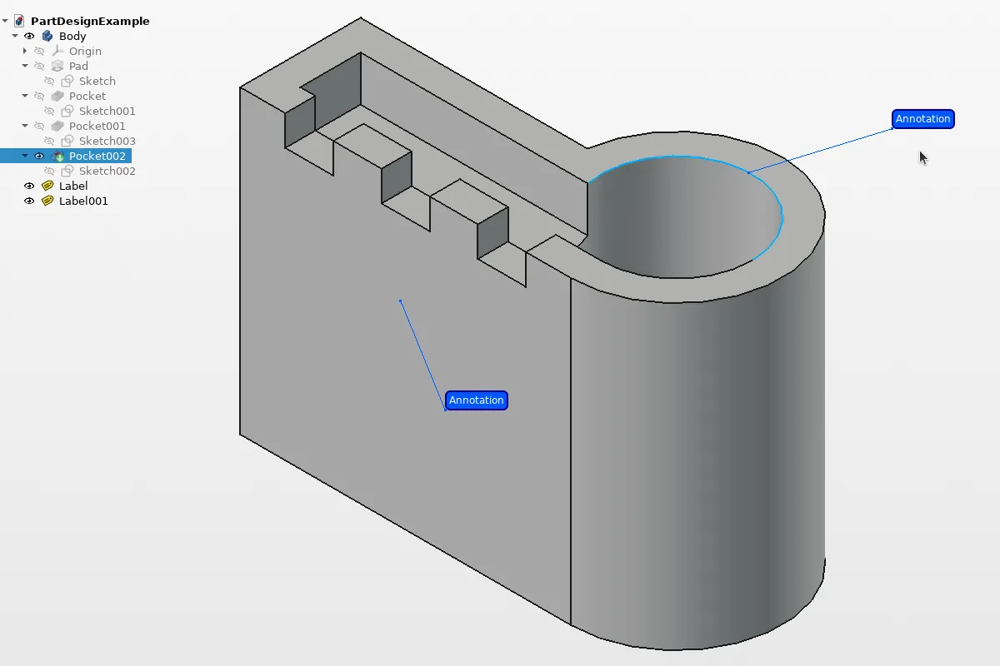
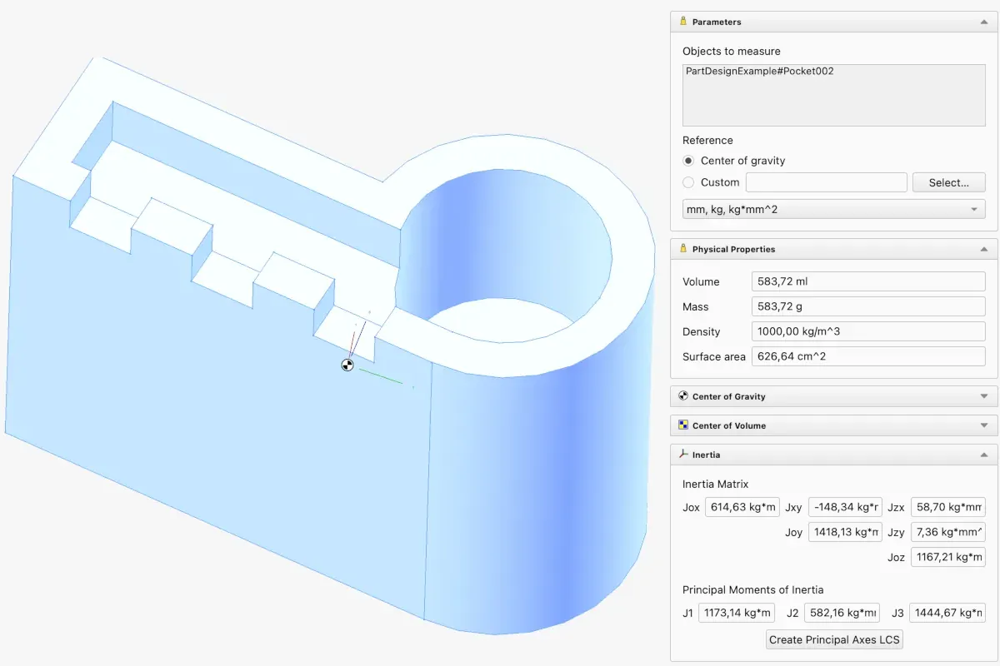
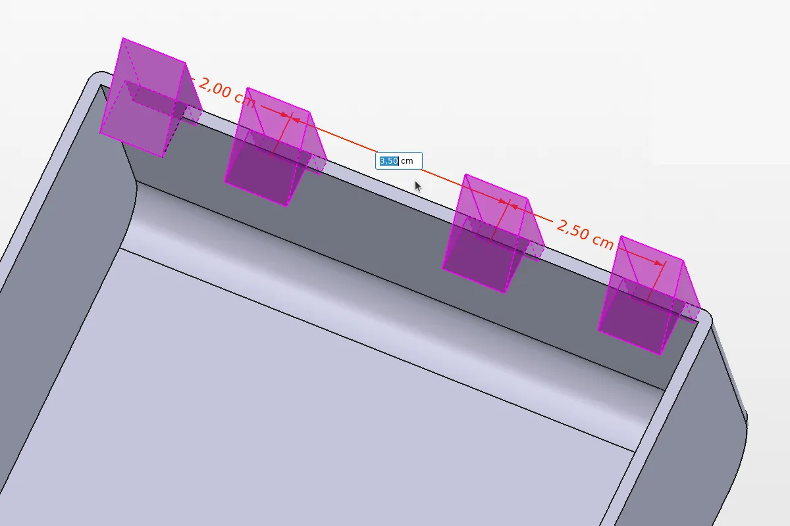
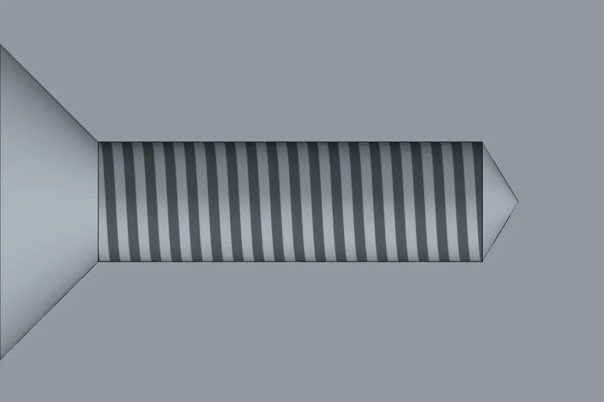
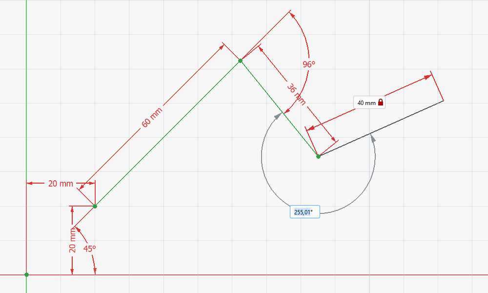
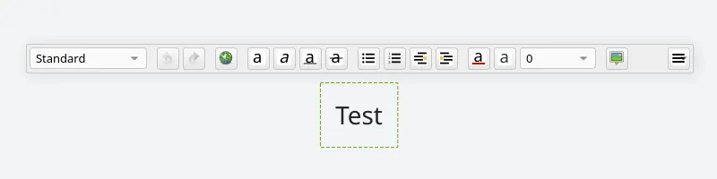
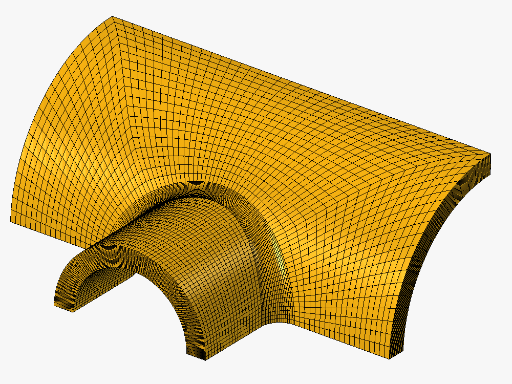

FreeCAD 26.3 blablabla ...

This release blablabla ...









- User Interface and Experience

















- Draft and BIM





- Others





And much more, thanks to hundreds of contributions from the community around the world.

**Want to be part of the journey?** Join the [community](community) and [donate](donate) to shape the future of FreeCAD.

As always — have fun and keep *FreeCADing*!
