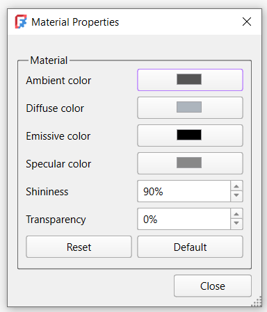
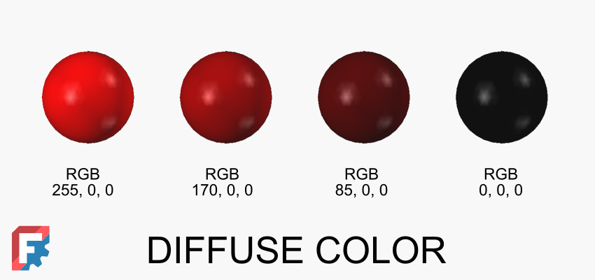
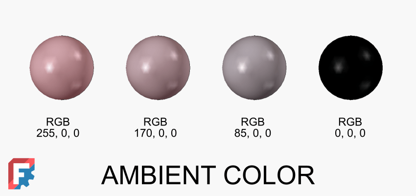
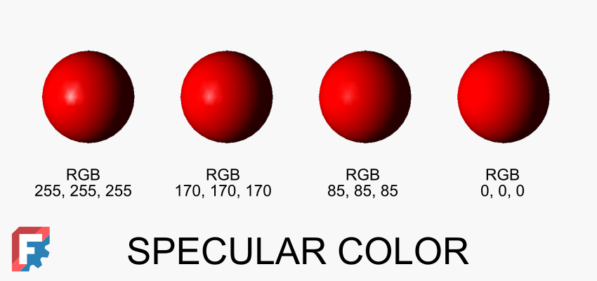
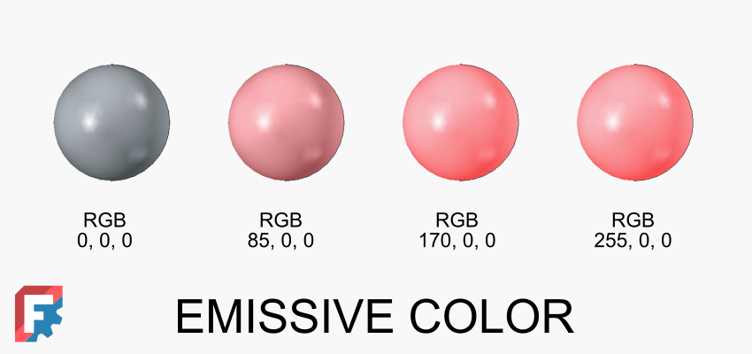
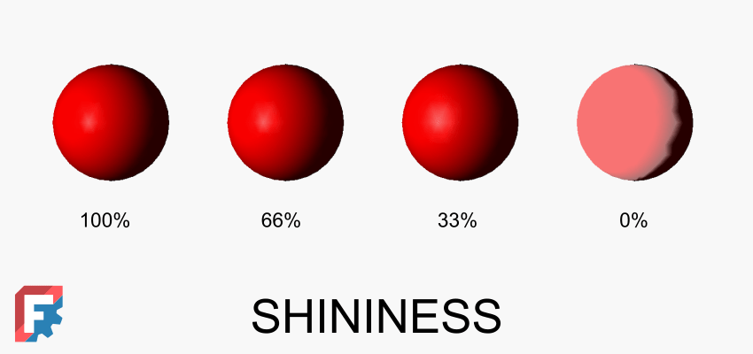
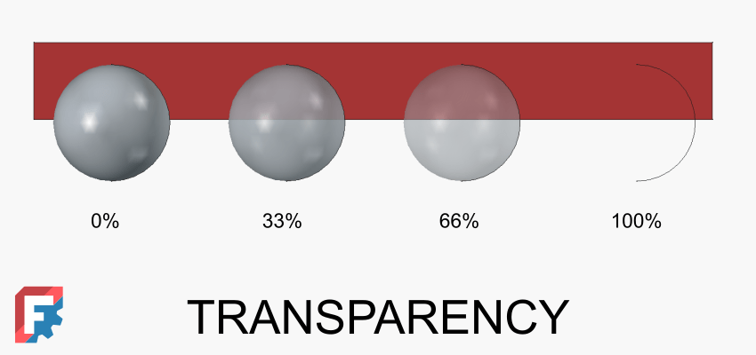
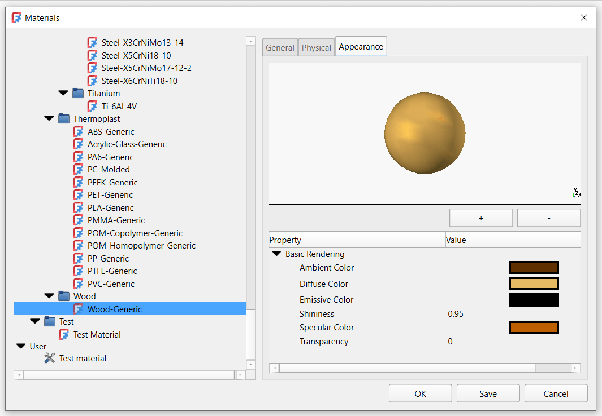

FreeCAD 1.0 introduced a new, refactored[ material system](https://wiki.freecad.org/Material_Workbench), which includes updated appearance properties of FreeCAD objects. What was previously one property 'Shape color' is now six new properties in the 'Shape Appearance' group of properties. This article explains how to set up these properties to achieve the desired surface look.

There are six appearance properties, which you can find in the **View** properties -> **Object Style** group under the **Shape Appearance** umbrella. These properties are:

- Diffuse Color
- Ambient Color
- Specular Color
- Emissive Color
- Shininess
- Transparency

Another way to access the appearance properties of an object is by opening the **Appearance **task panel (Ctrl+D shortcut) and clicking the **Appearance **button, which opens the **Material Properties** dialog.

These six properties define the 'look' of an object: its color, whether it is shiny or not, and how transparent it is. On a more technical level, each of these properties influences the calculation of how light interacts with an object's surface, and thus how the surface looks to an observer. Let's have a look at how each of these properties influences the appearance of an object's surface.

**Diffuse Color** defines the surface's base color when illuminated. It represents how the object scatters light evenly in all directions, independent of the viewer's angle. In layman's terms, this defines the color of the surface.

**Ambient Color **defines the color of a surface under indirect, uniform lighting, representing how it appears when illuminated only by ambient light in a scene, without directional light, shading, or highlights. In other words, this defines the color of the surface hit by indirect uniform light.

Ambient color is much less prominent than the diffuse color. For a typical material like plastic, the ambient color should be set to a darker shade of diffuse color. So if a diffuse color of an object is set to bright red RGB (255, 0, 0), the appropriate ambient color could be set to RGB (200, 0, 0). As ambient color's influence on the surface appearance is not so powerful, for most uses in FreeCAD it is OK to leave the default ambient color, which is RGB (85, 85, 85).

**Specular Color** defines the color and intensity of the bright, mirror-like highlights that appear on shiny or reflective surfaces when light hits them directly. Basically, how shiny the surface is - bright colors define shiny surface and dark colors define matte surface.

A standard material like plastic, rubber, or wood does not influence reflections by its own color. So to simulate this, only shades of gray should be used in the specular color. Metals like gold or copper tint the reflection, so you can use color values in the specular color definition.

**Emissive Color** defines the color of a surface that appears to emit light, independent of external lighting, making the object look self-illuminated. Note that this does not simulate a light in the FreeCAD 3D space, it only creates an illusion of light emission. So even if a bright color is set as an emissive color for a surface, other objects in the 3D space will not be influenced by this emission. For materials that do not emit light, set this property to black RGB (0, 0, 0).

**Shininess** defines the size and sharpness of specular highlights on a surface. Higher values produce small, sharp highlights, while lower values create broad, soft highlights. It is closely linked to the Specular Color. While Specular Color defines the intensity of reflections, Shininess defines their size. It's best not to set Shininess to too low percentage values, as a large part of the surface could be covered by specular highlights.

**Transparency** defines how much light passes through an object, making it partially or fully see-through. Use 0% for opaque surfaces and 100% for fully transparent surfaces.

These six core appearance properties enable FreeCAD users to achieve various surface interactions with light, allowing them to simulate the appearance of different types of materials. These properties are also widely used in the CG (Computer Graphics) industry, so most rendering engines should be able to support them.

Note that every FreeCAD material can have an appearance assigned with these basic appearance properties. If said material is then applied to an object, the appearance properties of the object are set from the material's appearance values.

To reiterate, for a typical FreeCAD user, setting the Diffuse Color is crucial for changing an object's color. This is roughly what Shape Color did in FreeCAD 0.21 and earlier versions. You can also adjust the gray value of Specular Color to adjust the reflectivity of an object. Changing these two values is typically sufficient for most use cases.