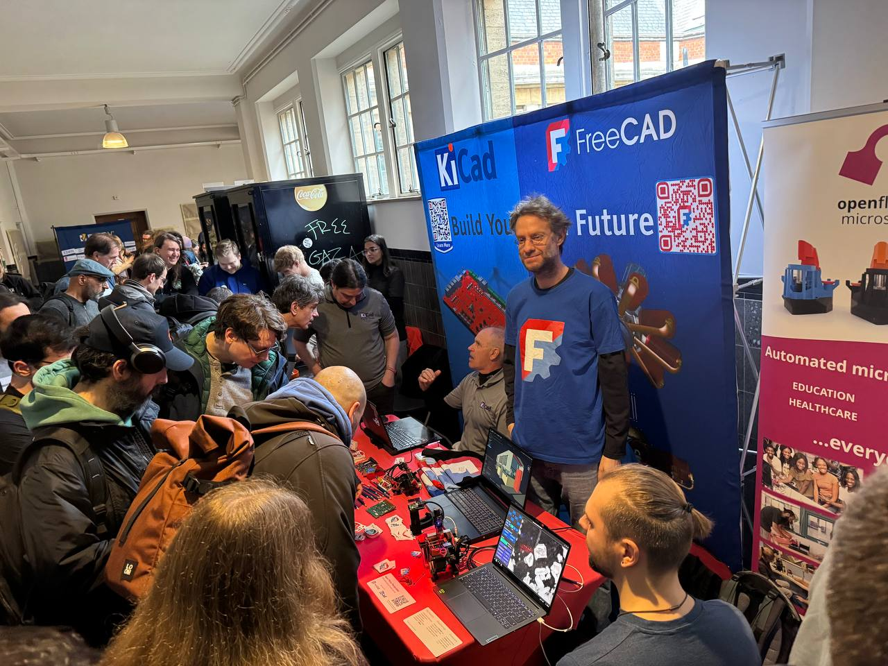
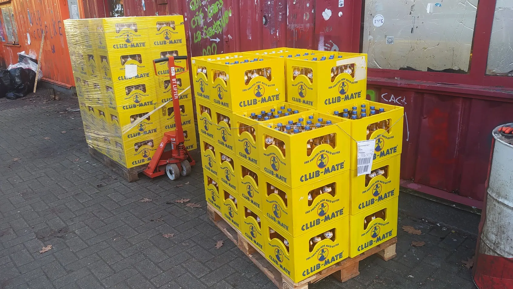

FOSDEM fell on the 31st January and the 1st of February this year and, as ever, FreeCAD had a presence at the excellent event in numerous ways.

Once again our main visible presence was on the joint FreeCAD and KiCad booth in the AW building which, as ever, saw great footfall. Many people moving through the AW building stopped for a chat as they know FreeCAD or KiCad but also we met a lot of people not knowing either project. It's always fun when they ask "are we the same company" or "is it the same project" and we can explain, "no we are two separate organisations who just really like each other and co-operate"! Something those who are less used to opensource find quite amazing!

The booth was crewed excellently both days by a range of FreeCAD and KiCad community members and lot's of brilliant conversations happened. To nudge the conversations along we had numerous brilliant examples of projects built with FreeCAD and KiCad on the table.

Once again we had some excellent examples of tiny satellites and related electronics on display from our friends and colleagues at the Libre Space Foundation. People were amazed to see the diminutive[ Qubik pocketcube satellite](https://libre.space/projects/qubik/), a fully operational satellite that has flown on orbit that measures only 50mm cubed.



We also had an excellent project from [@cccpresser](https://mastodon.social/@cccpresser@chaos.social), a wonderful KiCad designed PCB mounted on a CNC brass base unit, which was milled using FreeCAD CAM WB. The PCB was an astonishingly accurate 1/1000 replica of Stonehenge with the henge blocks being built out of a collection of SMD components including LED's. An amazing and beautiful example of what can be achieved with our projects.



A big draw item on the booth was the excellent display of the opensource [Micro Manipulators from Diffraction Limited](https://github.com/0x23/MicroManipulatorStepper). These micro manipulators are capable of sub micron resolution and have had pretty wide coverage online, [for example on Hackaday.com](https://hackaday.com/2025/09/04/designing-an-open-source-micro-manipulator/). It was fabulous to have 2 of these machines set up and running on the desk, with one being an excellent microscope setup where you could move tiny salt crystals around on the stage. Massive thanks to Manu for travelling over to FOSDEM and being extremely busy on the booth showing off the project.



Previously our friends an colleagues at KiCad have voluntarily been the devroom managers for the [Open Hardware CAD/CAM dev room](https://fosdem.org/2026/schedule/track/open-hardware-and-cadcam/) talk track at FOSDEM. This year however it was FreeCAD teamsters @chennes and @concretedog who took over the reigns aided and abetted by Kliment and others. It's a fair amount of work to collate and review all the talk proposals (thanks volunteer review team members) but we were pleased to have a really nice range of excellent talks in the room. There are lots of favourites and we enjoyed them all, you can check out the FOSDEM site to view all the talks from all the rooms. Just as a flavour we enjoyed hosting Ryan Walker speaking on "[The Blackpants are Pants for your Blackhat](https://fosdem.org/2026/schedule/event/WDCDC3-the_blackpants_are_pants_for_your_blackhat/)" a story about the design and development of an enhanced Flipper Zero style device. It was  also great to hear Morgan speaking about his development of [KiConnect](https://git.oit.cloud/morgan/kiconnect), a FreeCAD workbench that powerfully allows for push pull interaction between FreeCAD and KiCad.



Of course we also had the main project updates for[ FreeCAD from Yorik](https://fosdem.org/2026/schedule/event/XPFS8X-freecad-state-of-affairs/), and [KiCad from Wayne](https://fosdem.org/2026/schedule/event/WDEHKY-kicad_status/) which were incredibly packed talks with the queue for the Open Hardware devroom stretching to over 100 people deep. Thanks to everyone for their patience about access to the devroom in this period as we need to be mindful of fire regulations and our capacity caps.



It was once again an excellent event for us and great to meet and mingle with so many FreeCAD users, developers and those curious to try it out. It's an intense weekend of activity and we'd like to thank everyone who gave up their time to come and support. We look forward to next year!

