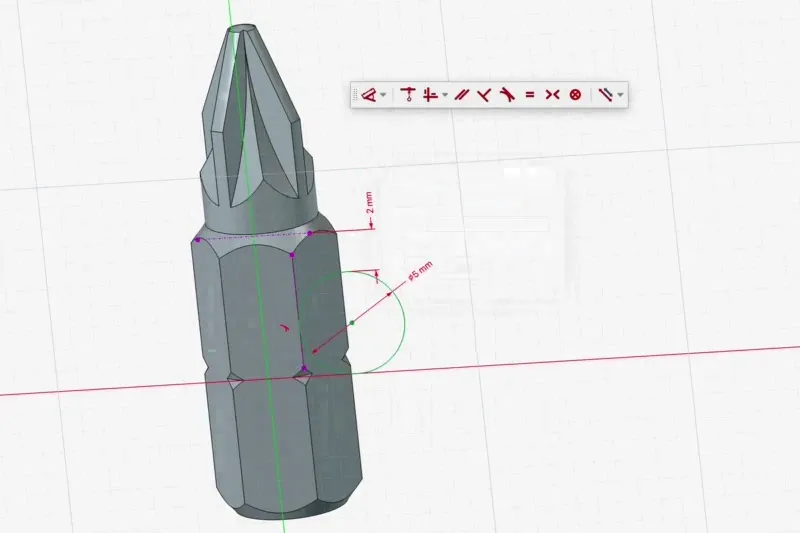
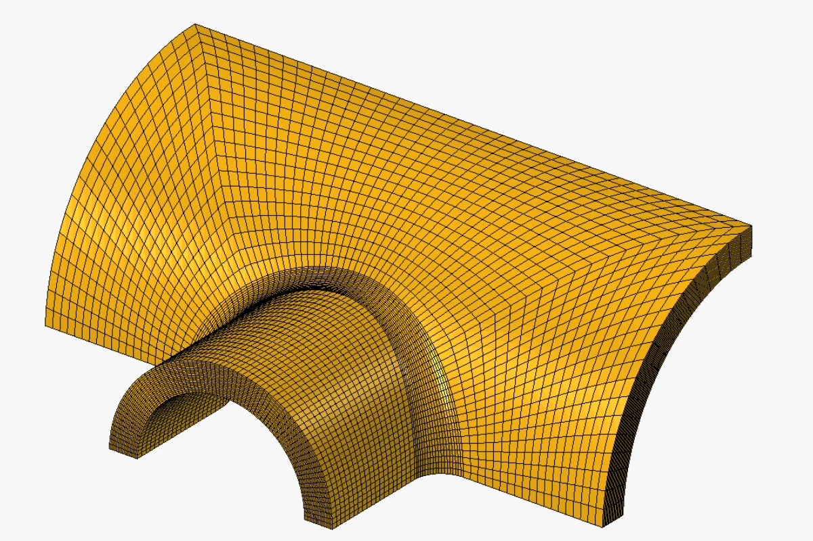

FreeCAD 26.3 is the first release on our new schedule of three releases per year, with calendar-based version numbers.

This release makes FreeCAD more responsive on large models, makes Part Design and the Sketcher more versatile, opens up multi-axis machining in CAM, and polishes workflows across every workbench.

<!-- TODO: replace with the 26.3 release video URL -->




- Edit multiple documents at the same time, each with its own tasks and undo/redo stack, so two sketches can be open simultaneously.
- Recomputes run in the background and are fine-grained, keeping the interface responsive even on large models.
- Fuzzy matching for autocompletion in the Expression Editor.
- New ==Mass Properties== command for volume, mass, density, surface area, center of gravity and inertia, with material-aware results and custom reference frames.
- Box selection by dragging is built into the common navigation styles.









- Parametric ==Defeaturing== tool and cosmetic threads on holes.
- Point, path and circular pattern types, suppression of individual pattern instances, and on-view parameters for custom spacing.
- Start offsets for Pad, Pocket, Hole, Revolution and Groove, to build several features from one master sketch without extra offset planes.
- A ==Common== operation for every subtractive feature, keeping only the material shared with the body.
- Creating a new sketch opens the attachment dialog unless a planar face or datum plane is already selected.







## Sketch smarter



- Reliable internal faces for complex overlapping geometry, now on by default for new sketches.
- Dimension and constraint tools pick model edges outside the sketch directly, creating the external reference automatically.
- Constraints are less prone to flipping.
- A new text tool (experimental).





")







- ==Snapshots== save and restore the placement and visibility of the whole assembly.
- A ==Rigid Group== joint fixes any number of components relative to each other.
- Link arrays for placing repeated components.
- Export simulations to video.
- Drag without a grounded component: an ungrounded island moves as a rigid group based on its joints.





- 3+2 indexed machining on tilted work planes, with new ==Planar Surface== and ==Rotary Surface== operations for 3D and 4th-axis surfacing.
- A machine library and editor with toolheads, rotary axes and limits, and a new machine-based post processing pipeline, plus generic and Heidenhain Klartext posts.
- A feeds and speeds helper calculating from material and tool geometry within the machine's limits.
- A redesigned Job panel, the simulator as a proper window inside the main interface, and posting only the selected operations.









- FEM builds hexahedral meshes automatically through new Gmsh refinements.
- The refactored CalculiX solver is now the default.





- TechDraw draws scenes much faster.
- Right-click context menus adapt to what is selected.
- A new ==Screen Mode== scales edges, vertices and annotations with the zoom level so they no longer obscure geometry in complex drawings.











- A ==Report== tool with an SQL-like query language.
- A ==Covering== tool for finishes and cladding.
- ==Trimex== trims and extends walls, pipes and structures directly by picking an end face, while extrusion moves to its own command.
- Typed values in coordinate, length and angle fields are locked, so mouse movements no longer overwrite them.





- Addons can use the toponaming API introduced internally in 1.0, as well as transparent previews.
- The Addon Manager uses git for very large addons, so updating the Parts Library only fetches what changed.
- FreeCAD builds against OpenCASCADE 8 while retaining OpenCASCADE 7 compatibility.
- Hundreds of bug fixes across every workbench.





And much more, thanks to hundreds of contributions from the community around the world.

**Want to be part of the journey?** Join the [community](community) and [help shape](donate) the future of FreeCAD.

As always — have fun and keep *FreeCADing*!
